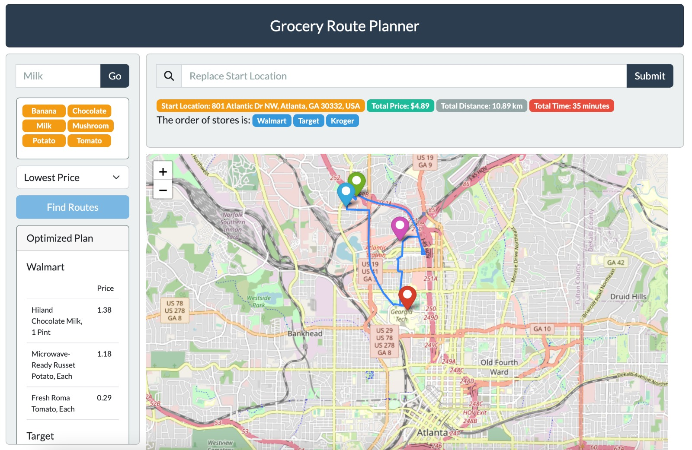

# GROGU: Grocery Route Organizer and Guidance Utility

Grogu is a a Flask and JS web app for grocery route planning. It helps you plan the most efficient route to take when you go grocery shopping. GROGU can take into account factors such as the stores you want to visit, the items on your shopping list, and the distance between stores to create the most time and cost-effective grocery route. With GROGU, you can save time, reduce stress, and minimize your expenses by avoiding unnecessary trips and making the most of your shopping experience.

This tool was made as part of the final course project for the [CSE6242](https://poloclub.github.io/cse6242-2023spring-campus/) course: Data and Visual Analytics at Georgia Tech. 

# Demo
Link to video demo available [here](https://youtu.be/QFwIVaNrK8I). 


Visualization of the optimal route determined by our algorithm for ordering the items input to the cart. 

# Running the code

Download conda/miniconda from [here](https://conda.io/projects/conda/en/stable/user-guide/install/download.html) and install it in your PC. Use conda to create a new virtual environment called `grocery_env` and then install the required packages in this environment. The commands to do it are given below:

```
>>> conda create -n grocery_env python=3.11
>>> conda activate grocery_env
>>> pip install -r requirements.txt
```

To run the flask server, use the following command:
```
python -m flask run -p 8088
```

This would start a local instance of the web application at port `8088`. You can access it on the browser at this link: `http://127.0.0.1:8088`. 

**Note**: You will have to add the Google Maps API key to your bash/zsh/powershell session by modifying the `zshrc` or `bashrc` file. You can either use the command `export GMAPS_API_SECRET_KEY=YOUR_KEY"` on the terminal, or you could also hardcode the API key in the flask configuration file provided in the `config.py` file. 

# Salient Features
1. User can choose items from our top 9 relevant results
2. Ranking is done using the **OKAPI BM25** algorithm for better precision and recall. Can always test the TF-IDF agorithm as well. Library used is Whoosh. Alternative library/tool => Elastic Search.
3. CSRF protection for security
4. Units for Kroger data were extracted using the `quantulum3` library.
5. Geocoding is done using the Google Maps API and the maps are currently generated using `folium`.
6. Code uses sessions extensively and does not use any databases.

